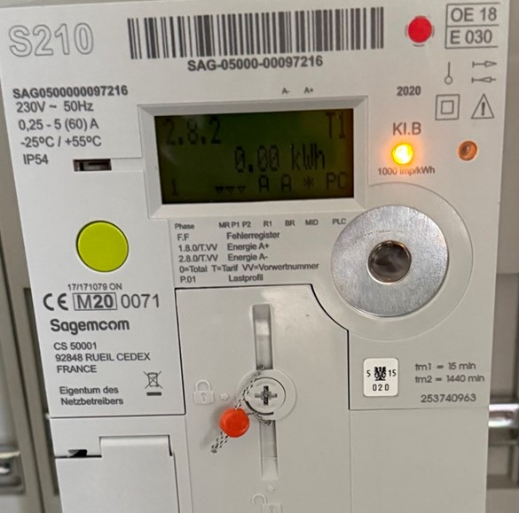
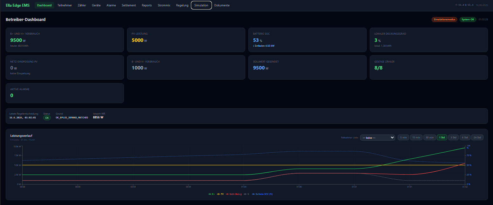
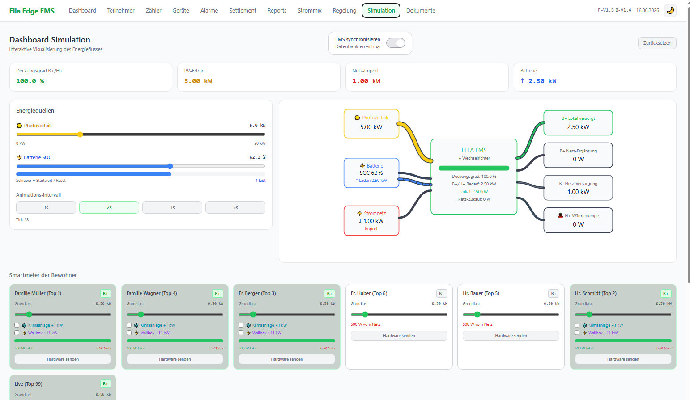

# Ella Edge EMS
## Lokales Energiemanagementsystem für Mehrparteienanlagen

> **Produktbeschreibung · Vollständige Übersicht** — Ella_EMS_Doc3 · Entwurf

Ella Edge EMS ermöglicht Bewohnern von Mehrparteienwohnanlagen mit gemeinsamer PV-Anlage
und Batteriespeicher, günstigen, selbst erzeugten Solarstrom zu beziehen —
vollautomatisch verteilt, fair abgerechnet und cloud-unabhängig betrieben.

---

## Technische Highlights auf einen Blick

| Symbol | Merkmal |
|--------|---------|
| ⚡ | 5-Sekunden Echtzeit-Regelung |
| 🏠 | 100 % lokal · cloud-frei |
| 🔒 | DSGVO-konform · kein Cloud-Zwang |
| 📊 | 15-min Settlement |
| 🔌 | SmartMeter Hardware-Push |
| 📄 | Automatische PDF/CSV-Berichte |
| 🔧 | Modbus TCP/RTU-ready |
| 📈 | Skalierbar · erweiterbar |

---

## 1 — Die Basis: PV-Anlage mit Batteriespeicher

Ella Edge EMS setzt auf einer bestehenden oder neu geplanten PV-Anlage mit
Wechselrichter und Batteriespeicher auf — ohne Eingriff in die
Elektroinstallation der einzelnen Wohneinheiten.

*Abb. 1 — PV-Anlage auf Mehrparteiengebäude*

Eine typische Anlage mit 20–50 kWp PV-Leistung und 15–30 kWh Batteriespeicher bildet die
Grundlage. Ella übernimmt die intelligente Echtzeit-Verteilung der lokal erzeugten Energie
an alle teilnehmenden Bewohner (B+) — sekundengenau und vollautomatisch.

---

## 2 — Zählerinfrastruktur: SmartMeter-Integration

*Abb. 2 — Landis+Gyr SmartMeter (z. B. E350 / MAP120)*

Je Wohneinheit wird ein geeichter SmartMeter installiert, der alle **10 Sekunden** den
Momentanverbrauch per Hardware-Push direkt an Ella Edge EMS meldet. Kein Cloud-Weg,
kein Polling — nur ein direkter HTTP-Push in das lokale EMS.

- **CID-basiertes Mapping** — Jedes Gerät wird einmalig in der Stammdatenverwaltung per
  Custom-ID (CID) zugeordnet — danach läuft die Kommunikation vollautomatisch.
- **Standardprotokoll** — Push-Parameter: Wirkleistung (Pact in kW), Gerätezeitstempel (LDT)
  und Geräte-ID (CID) per HTTP-POST.
- **Keine Eingriffe nötig** — Der SmartMeter wird parallel zur bestehenden Installation
  montiert. Keine Änderungen an Verbrauchsgeräten der Bewohner.
- **Erweiterbar** — Weitere Zähler (Wärmepumpe H+, Ladeinfrastruktur) werden mit derselben
  Methode integriert.

---

## 3 — Nutzen für die Bewohnerin / den Bewohner (B+)

Bewohner, die als **B+** der Energiegemeinschaft beitreten, beziehen lokal erzeugten
Solar- und Batteriespeicherstrom zu einem günstigeren Tarif — direkt aus der eigenen
Wohnanlage.

- ✓ **Günstiger grüner Strom** — Der Lokaltarif liegt unter dem öffentlichen Netzbezugspreis
  und über der Einspeisevergütung — ein fairer Preis für beide Seiten.
- ✓ **Kein technischer Aufwand** — Ein SmartMeter genügt. Keine Eingriffe in Haushaltsgeräte,
  keine Apps zur Steuerung, kein manueller Aufwand.
- ✓ **Volle Transparenz** — Das persönliche Bewohner-Dashboard zeigt Echtzeit-Verbrauch,
  lokalen Deckungsgrad und die monatliche EUR-Einsparung gegenüber dem Netzbezug.
- ✓ **Freiwillige Teilnahme** — Opt-in und jederzeit kündbar. Nicht-Teilnehmer (B–) bleiben
  unverändert am öffentlichen Netz.
- ✓ **Faire automatische Verteilung** — Die verfügbare Lokalenergie wird proportional zum
  Verbrauch auf alle B+-Teilnehmer aufgeteilt — kein Teilnehmer wird bevorzugt.
- ✓ **Nachvollziehbare Monatsabrechnung** — Automatisch generierte PDF-Abrechnung: lokale kWh,
  Netz-kWh, Tarife und Einsparung übersichtlich auf einer Seite.
- ✓ **Identifikation mit der eigenen Anlage** — „Ich nutze den Strom aus meiner eigenen
  Wohnanlage" — ein konkreter, täglich sichtbarer Mehrwert.

---

## 4 — Nutzen für den Betreiber der Wohnanlage / Hausverwaltung

Für Eigentümergemeinschaften, Bauträger und Hausverwaltungen mit bestehender oder
geplanter PV-Anlage bietet Ella Edge EMS eine vollständige Betreiberlösung —
vom Echtzeit-Monitoring bis zur gesetzeskonformen Abrechnung.

- ✓ **Maximale Eigennutzung der PV-Anlage** — Ella verteilt lokal erzeugten Strom vorrangig
  an teilnehmende Bewohner und verhindert unnötige Einspeisung ins öffentliche Netz.
- ✓ **Bessere Wirtschaftlichkeit des Batteriespeichers** — Der Wechselrichter-Sollwert wird
  alle 5 Sekunden an den aktuellen B+-Gesamtbedarf angepasst — bedarfsgerecht, kein
  Überschuss, kein Mangel.
- ✓ **Zusätzliche Einnahmequelle** — Der Betreiber erzielt Einnahmen aus dem Verkauf lokaler
  Energie an B+-Teilnehmer zum Lokaltarif — eine neue, kalkulierbare Ertragsquelle.
- ✓ **Professionelles Betreiber-Dashboard** — Echtzeit-Überblick über PV-Leistung,
  Batterie-SOC, Netzfluss und Regelstatus. Alarm-Management und Settlement-Freigabe im
  Browser.
- ✓ **Gesetzeskonforme Abrechnung ohne Mehraufwand** — 15-Minuten-Settlement gemäß
  österreichischer Messregeln, Plausibilitätsprüfung und automatische Berichterstellung
  inklusive.
- ✓ **Bewohnerbindung durch modernes Energiekonzept** — B+-Teilnehmer schätzen günstigen
  Strom und ein transparentes Abrechnungssystem — ein echter Mehrwert bei Vermietung.
- ✓ **Skalierbarkeit ohne Systemwechsel** — Mehr Wohneinheiten, zusätzliche Zähler oder eine
  zweite PV-Anlage werden ohne Architekturwechsel integriert.
- ✓ **Lokaler Betrieb · keine Cloud-Abhängigkeit** — Das System läuft auf einem DIN-Rail-PC
  im Schaltschrank. Keine Cloud-Gebühren, kein Internet-Zwang, volle Datensouveränität.

*Abb. 3 — Betreiber-Dashboard: Live-Kacheln, Leistungsverlauf und Regelstatus*

Live-Kacheln (oben) zeigen B+/H+-Gesamtverbrauch, PV-Leistung, Batterie-SOC und lokalen
Deckungsgrad. Der Leistungsverlauf (Mitte) stellt B+, PV, Netzbezug und Batterie-SOC über
wählbare Zeitfenster dar — mit optionaler Einzelteilnehmer-Overlay-Linie. Unten: Letzte
Regelentscheidung mit Grund-Code und Istwert des Wechselrichters.

---

## 5 — Nutzen für Komplettanbieter / Systemlösungsanbieter / Projektplaner

Ella Edge EMS verwandelt eine Hardware-Installation in eine vollständige,
betreibbare Energielösung — mit Software, Monitoring, Abrechnung und Betrieb
als eigenständige, abrechenbare Leistung.

- ✓ **Differenzierung vom Wettbewerb** — Nicht nur PV + Speicher — Komplettlösung inkl.
  lokalem Energiemanagement, Bewohner-Portal und Abrechnungsservice.
- ✓ **Deutlich höherer Projektwert** — Software, Inbetriebnahme, Monitoring, Reporting und
  Abrechnungsservice erhöhen den Gesamtauftragswert mit höheren Margen.
- ✓ **Kürzere Amortisation für den Endkunden** — Erlöse aus lokalem Stromverkauf verkürzen
  die Amortisationszeit der PV-/Speicheranlage spürbar.
- ✓ **Wiederkehrende Einnahmen** — Lizenz- oder Servicegebühren sichern planbare,
  wiederkehrende Erlöse über die gesamte Anlagenlaufzeit.
- ✓ **Folgegeschäfte durch offene Architektur** — Speichererweiterung, EV-Ladeinfrastruktur,
  Wärmepumpenoptimierung (H+) und Multi-Site-Betrieb sind vorbereitet.
- ✓ **Professionelle Demos mit Simulationsmodus** — Ohne Produktivanlage demonstrierbar —
  der integrierte Simulationsmodus zeigt Energieflüsse und Dashboard live im Browser.
- ✓ **Schnelle Integration** — Offene RESTful API, SmartMeter Hardware-Push per CID-Mapping,
  Modbus TCP/RTU-Vorbereitung — standardkonforme Schnittstellen.
- ✓ **Managed Service als Dienstleistung** — Fernmonitoring, Alarm-Management, monatliche
  Berichte und Settlement-Freigabe als eigenständiges Servicemodell anbietbar.

*Abb. 4 — Simulationsdashboard: Energiefluss-Visualisierung und Hardware-Push-Test*

Konfigurierbare Parameter: PV-Leistung, Batterie-SOC, Verbrauch je Bewohner, B+/B–-Status
und H+-Wärmepumpe. Live-Energieflussdiagramm in Echtzeit. Hardware-Push-Modus sendet Werte
per SmartMeter-Protokoll — das Betreiber-Dashboard reagiert sofort, als würde ein realer
Zähler liefern. Ideal für Verkaufspräsentationen ohne Produktivanlage.

---

## 6 — Technische Eckdaten

| Merkmal | Wert |
|---------|------|
| Messintervall | 5 Sekunden (Echtzeit-Regelung) |
| Settlement-Intervall | 15 Minuten (AT-Messregeln konform) |
| Regelung | Wechselrichter-Sollwert automatisch angepasst |
| Zähler-Integration | SmartMeter Hardware-Push (CID-Mapping) |
| Protokolle | Modbus TCP, Modbus RTU (vorbereitet) |
| Datenbank | SQLite WAL-Modus, lokal auf DIN-Rail-PC |
| Betriebsumgebung | Docker, DIN-Rail-PC, keine Cloud |
| Berichte | PDF (Bewohner, Betreiber), CSV-Detail, Diagnose-ZIP |
| Dashboard | Webbasiert, responsive — kein App-Zwang |
| Erweiterungen | EV-Ladeinfrastruktur, Wärmepumpe (H+), Multi-Site |
| Datenschutz | DSGVO-konform, alle Daten bleiben im Gebäude |
| Lizenz | Auf Anfrage — Einmal- oder Subskriptionsmodell |

---

**Ella Edge EMS**
Entwickelt von Sailer Engineering · www.sailersoft.com

*Ella_EMS_Doc3 · Entwurf · Alle Angaben ohne Gewähr · Änderungen vorbehalten*
